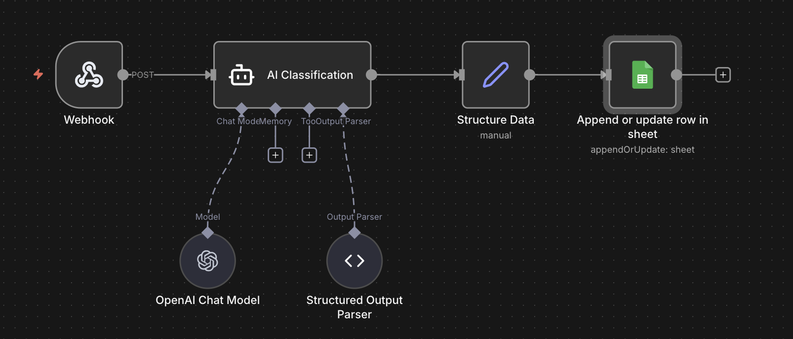

# 🤖 AI Customer Support Automation System (Beastlife Assignment)

## 📌 Overview

This project demonstrates an AI-driven customer support automation system designed to analyze customer queries, classify issues, and store structured data for insights and automation.

The system helps reduce manual workload, improve response time, and identify common customer issues using AI workflows.

---

## 🎯 Objective

* Automatically analyze incoming customer queries
* Classify queries into predefined categories
* Store structured data for analysis
* Enable automation and dashboard insights

---

## ⚙️ Workflow Architecture

```
Webhook (Receive Query)
        ↓
AI Classification (OpenAI)
        ↓
Structure Data (Format Output)
        ↓
Google Sheets (Store Data)
        ↓
(Optional) Auto Reply / Escalation
```

---

## 🧠 AI Categorization

The system uses an LLM (OpenAI) to classify queries into the following categories:

* Order Tracking
* Delivery Delay
* Refund Request
* Product Complaint
* Subscription Issue
* Payment Failure
* General Query

### Example:

**Input:**

```
My order is not delivered yet
```

**Output:**

```
Delivery Delay
```

---
## 🖼 Workflow Diagram




* n8n workflow
* AI classification node
* Google Sheets output
* Dashboard chart

---
## 🔄 n8n Workflow

The workflow is built using n8n and includes:

* Webhook node to receive incoming queries
* OpenAI node for classification
* Set node to structure data
* Google Sheets node to store results

---

## 📊 Data Storage

Customer queries are stored in Google Sheets in structured format:

| Query               | Category       |
| ------------------- | -------------- |
| Refund not received | Refund Request |

This data can be used to build dashboards and analyze trends.

---

## 📈 Insights & Use Case

From the sample dataset:

* Order Tracking, Delivery Delay, Refund Requests, and Product Complaints each contribute ~20%
* Payment Failures and General Queries contribute ~10%

### Key Insight:

Logistics and product quality are the major areas requiring improvement, while repetitive queries can be automated using AI.

---

## ⚡ Automation Opportunities

* Order Tracking → Auto-send tracking link
* Delivery Delay → Notify logistics team
* Refund Request → Auto-send refund process
* Product Complaint → Escalate to support team
* General Query → AI chatbot response
* Payment Issues → Generate support ticket

---

## 🛠️ Tech Stack

* AI Model: OpenAI GPT
* Automation: n8n
* Database: Google Sheets
* Dashboard: Excel (Pivot Table + Pie Chart)
* Integration: Webhooks / APIs

---

## 🚀 How It Works

1. User sends a query via webhook
2. AI model classifies the query
3. Data is structured and stored
4. Insights can be generated via dashboard
5. Automation can trigger responses

---

## 💡 Conclusion

This system demonstrates how AI and automation can significantly improve customer support by:

* Reducing manual effort
* Providing faster responses
* Generating actionable insights
* Scaling support operations efficiently

---

## 🔗 Author

**Nithin M**
📧 [nithinmgowda06@gmail.com](mailto:nithinmgowda06@gmail.com)
🔗 https://www.linkedin.com/in/nithinm06/

---
