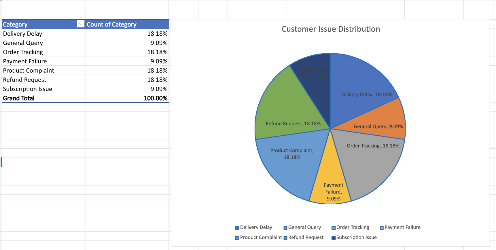
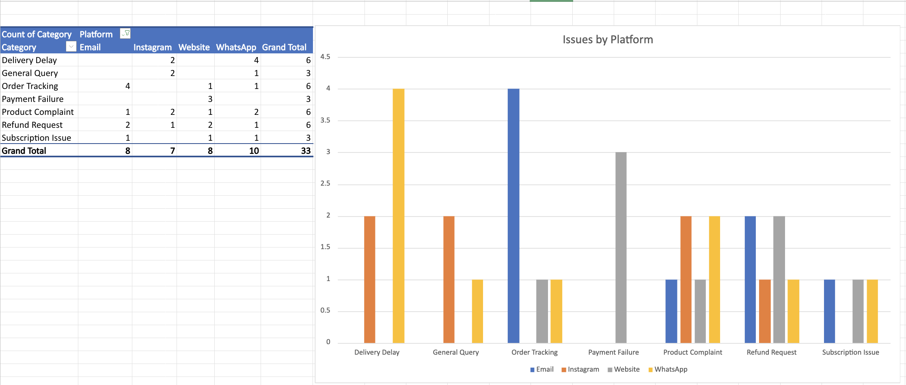

# 🤖 AI Customer Support Automation System (Beastlife Assignment)

## 📌 Overview

This project demonstrates an AI-driven customer support automation system that analyzes incoming customer queries, classifies them into predefined categories using AI, and stores structured data for insights and automation.

A working prototype is built using **n8n**, showcasing real-time AI-powered workflow automation integrated with Google Sheets and dashboard analytics.

---

## 🎯 Objective

* Automatically analyze incoming customer queries
* Classify queries into predefined categories using AI
* Store structured data for analysis
* Generate insights through dashboards
* Enable automation and scalable support workflows

---

## ⚙️ Workflow Architecture

Webhook (Receive Query) → AI Classification (OpenAI) → Structure Data → Google Sheets → (Optional Auto Reply / Automation)

---

## 🧠 AI-Powered Query Classification

The system uses an LLM (OpenAI) to classify queries into the following categories:

* Order Tracking
* Delivery Delay
* Refund Request
* Product Complaint
* Subscription Issue
* Payment Failure
* General Query

### Example

**Input:**

```
My order is not delivered yet
```

**Output:**

```
Delivery Delay
```

---

## 🧪 Live Workflow Example

**Webhook Input:**

```json
{
  "query": "My order is not delivered yet"
}
```

**AI Output:**

```
Delivery Delay
```

**Stored Output (Google Sheets):**

| Query                         | Category       |
| ----------------------------- | -------------- |
| My order is not delivered yet | Delivery Delay |

---

## 🖼 Workflow Diagram


---

## 🔄 n8n Workflow

The workflow is implemented using **n8n** and includes:

* Webhook node to receive queries
* OpenAI node for classification
* Structured Output Parser for clean JSON response
* Set node to structure data
* Google Sheets node to store results

📁 **Workflow File:**
`workflow.json` → Contains the complete n8n workflow export for replication

---

## 📊 Dashboard & Insights

### 📌 Issue Distribution



This chart shows the percentage distribution of customer issues:

* ~18.18% → Delivery Delay, Order Tracking, Product Complaint, Refund Request
* ~9.09% → General Query, Payment Failure, Subscription Issue

---

### 📌 Platform-wise Issue Analysis



This chart shows how issues are distributed across platforms (WhatsApp, Email, Website, Instagram).

#### Key Insights:

* WhatsApp has the highest volume of issues
* Website and Email also contribute significantly
* Helps identify platform-specific problem areas

---

## 📊 Data Storage

Customer queries are stored in **Google Sheets** in structured format:

| Query | Category | Timestamp |
| ----- | -------- | --------- |

This enables:

* Trend analysis
* Dashboard creation
* Automation triggers

---

## 📈 Business Insights

* Logistics-related issues (Delivery Delay, Order Tracking) are frequent
* Product complaints and refunds are also major contributors
* Repetitive queries can be automated using AI

---

## ⚡ Automation Opportunities

* Order Tracking → Auto-send tracking link
* Delivery Delay → Notify logistics team
* Refund Request → Trigger refund workflow
* Product Complaint → Escalate to support
* General Query → AI chatbot response
* Payment Issues → Generate support ticket

---

## 📈 Scalability

* Webhook-based architecture supports high traffic
* AI enables real-time classification
* Easily integrates with CRM, chatbots, and APIs
* Reduces manual workload significantly

---

## 🚀 Future Enhancements

* WhatsApp & Instagram API integration
* Real-time chatbot automation
* Sentiment analysis for prioritization
* Power BI / Looker Studio dashboards
* Multi-language support

---

## 🛠️ Tech Stack

* **AI Model:** OpenAI GPT
* **Automation:** n8n
* **Database:** Google Sheets
* **Visualization:** Excel (Pivot Tables + Charts)
* **Integration:** Webhooks / APIs

---

## 🚀 How It Works

1. User sends query via webhook
2. AI model classifies the query
3. Structured data is generated
4. Data is stored in Google Sheets
5. Dashboard visualizes insights
6. Automation can trigger responses

---

## 💡 Conclusion

This project demonstrates how AI + automation can transform customer support by:

* Reducing manual effort
* Improving response time
* Generating actionable insights
* Enabling scalable operations

---

## 🔗 Author

**Nithin M**
📧 [nithinmgowda06@gmail.com](mailto:nithinmgowda06@gmail.com)
🔗 https://www.linkedin.com/in/nithinm06/

---
